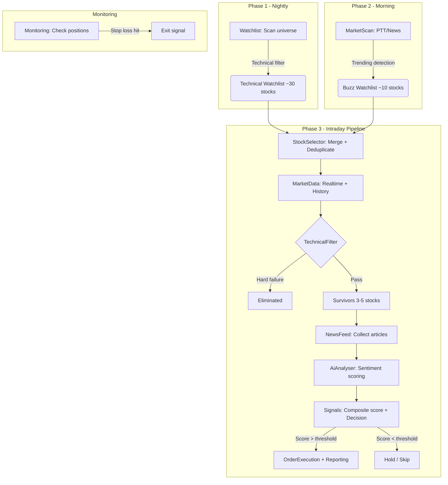

# Stock Agent - Taiwan Stock Trading Pipeline

## Overview

An automated stock analysis pipeline for the Taiwan Stock Market (TWSE/TPEX). Combines nightly technical screening, social media buzz detection, and intraday AI-powered analysis to generate trade signals.



---

## Architecture

```
Layer Boundaries
┌─────────────────────────────────────────────────────────────────┐
│ Layer A (Domain)                                                │
│                                                                 │
│   ✓ Models (SQLModel data structures)                           │
│   ✓ Ports (Protocol interfaces, no implementation)              │
│   ✓ Rules (pure business logic, no I/O)                         │
│   ✓ Types (enums, constants)                                    │
│                                                                 │
│   ✗ No imports from Layer B, C, D                               │
│   ✗ No I/O operations                                           │
└─────────────────────────────────────────────────────────────────┘

┌─────────────────────────────────────────────────────────────────┐
│ Layer B (Application)                                           │
│                                                                 │
│   ✓ Use Cases (orchestrate domain rules + ports)                │
│   ✓ Schemas (config)                                            │
│   ✓ Factories (assemble policies from config)                   │
│   ✓ Pipeline / Workflow (orchestrate use cases)                 │
│                                                                 │
│   ✗ No direct database/API calls                                │
│   ✗ Business logic belongs in Domain Rules                      │
└─────────────────────────────────────────────────────────────────┘

┌─────────────────────────────────────────────────────────────────┐
│ Layer C (Infrastructure)                                        │
│                                                                 │
│   ✓ AI model adapters (OpenAI, Grok, Gemini, Groq)             │
│   ✓ Persistence (ChromaDB, In-Memory)                           │
│   ✓ Platform integrations (LINE)                                │
│   ✓ External services (Tavily search)                           │
└─────────────────────────────────────────────────────────────────┘

┌─────────────────────────────────────────────────────────────────┐
│ Layer D (Presentation)                                          │
│                                                                 │
│   ✓ FastAPI web app + webhook endpoints                         │
│   ✓ Flet desktop admin console                                  │
│   ✓ Dependency injection                                        │
└─────────────────────────────────────────────────────────────────┘
```

---

## Three-Phase Workflow

| Phase    | Use Case     | Runs When    | Output                   |
| -------- | ------------ | ------------ | ------------------------ |
| Nightly  | `Watchlist`  | After hours  | Technical Watchlist (DB) |
| Morning  | `MarketScan` | Pre-market   | Buzz Watchlist (DB)      |
| Intraday | `Pipeline`   | Market hours | Trade Signals + Orders   |

Orchestrated by `WorkflowOrchestrator` with `run_full_cycle()`, or run individually.

---

## Technical Analysis Rules

### Screening Policy (Three-Tier System)

Based on Elder's Triple Screen methodology:

| Tier          | Effect                         | Applied To                                                 |
| ------------- | ------------------------------ | ---------------------------------------------------------- |
| `must_pass`   | Hard gate — elimination        | Setup (TECHNICAL only) + Safety (all) + Entry Timing (all) |
| `should_pass` | Soft penalty — reduces score   | All sources                                                |
| `info_only`   | Observation — logged for audit | All sources                                                |

### Source-Based Rule Application

| Source              | Setup must_pass | Safety must_pass | Entry Timing | should_pass | info_only |
| ------------------- | --------------- | ---------------- | ------------ | ----------- | --------- |
| TECHNICAL_WATCHLIST | ✅ All          | ✅ All           | ✅ All       | ✅ All      | ✅ All    |
| SOCIAL_BUZZ         | ❌ Skip         | ✅ All           | ✅ All       | ✅ All      | ✅ All    |
| MANUAL_INPUT        | ❌ Skip         | ✅ All           | ✅ All       | ✅ All      | ✅ All    |

### Rule Categories

#### Trend (`indicators/trend/`)

| Rule                   | Logic                            | Reference                       |
| ---------------------- | -------------------------------- | ------------------------------- |
| `PriceAboveMaRule`     | Price > specified MA period      | Murphy (1999)                   |
| `MaAlignmentRule`      | Fast MA > Slow MA                | Murphy (1999)                   |
| `GoldenCrossRule`      | MA20 crossed above MA60 recently | Murphy (1999), Bulkowski (2005) |
| `AdxTrendStrengthRule` | ADX between min-max range        | Wilder (1978)                   |
| `AdxDirectionRule`     | +DI > -DI                        | Wilder (1978)                   |

#### Momentum (`indicators/momentum/`)

| Rule                      | Logic              | Reference                   |
| ------------------------- | ------------------ | --------------------------- |
| `RsiRangeRule`            | RSI within min-max | Wilder (1978), Brown (1999) |
| `MacdCrossRule`           | MACD Line > Signal | Appel (2005)                |
| `MacdPositiveRule`        | MACD Line > 0      | Appel (2005)                |
| `MacdHistogramRule`       | Histogram > 0      | Elder (1993)                |
| `StochasticThresholdRule` | %K < threshold     | Lane (1984)                 |
| `StochasticCrossRule`     | %K > %D            | Lane (1984)                 |
| `MfiThresholdRule`        | MFI < threshold    | Quong & Soudack (1989)      |

#### Volume (`indicators/volume/`)

| Rule               | Logic                | Reference        |
| ------------------ | -------------------- | ---------------- |
| `VolumeRatioRule`  | Volume > ratio × avg | Murphy (1999)    |
| `ObvTrendRule`     | OBV > OBV MA20       | Granville (1963) |
| `LiquidityRule`    | Avg volume > minimum | O'Neil (1988)    |
| `MinimumPriceRule` | Price > minimum      | O'Neil (1988)    |

#### Volatility (`indicators/volatility/`)

| Rule                     | Logic                 | Reference                       |
| ------------------------ | --------------------- | ------------------------------- |
| `BollingerThresholdRule` | %B < max threshold    | Bollinger (2001)                |
| `BollingerPositionRule`  | Price > Middle Band   | Bollinger (2001)                |
| `BollingerSqueezeRule`   | Bandwidth < threshold | Bollinger (2001)                |
| `AtrRangeRule`           | ATR% within min-max   | Wilder (1978), Van Tharp (2006) |
| `DailyRangeRule`         | Daily range < max     | Elder (1993)                    |

#### Entry Timing (`indicators/entry_timing/`)

| Rule                     | Logic                    | Reference                |
| ------------------------ | ------------------------ | ------------------------ |
| `PriceDropRule`          | Today's drop < threshold | Livermore (1940)         |
| `IntradayMomentumRule`   | Close > Open             | Schwartz (1998)          |
| `VolumeConfirmationRule` | Volume > ratio × avg     | Murphy (1999)            |
| `GapRule`                | Gap up < threshold       | Elder (1993)             |
| `IntradayRangeRule`      | Not at intraday high     | Schwartz (1998)          |
| `ConsecutiveUpDaysRule`  | < N consecutive up days  | Connors & Raschke (1995) |

---

## Strategy Configurations

Strategies are defined in `config/strategies.yaml` and loaded as `StrategyThresholds`:

| Strategy     | Factory Function                    | Character                      |
| ------------ | ----------------------------------- | ------------------------------ |
| Conservative | `create_conservative_policy()`      | Strict setup + safety gates    |
| Moderate     | `create_moderate_policy()`          | Balanced — relaxed setup rules |
| Nightly      | `create_nightly_screening_policy()` | No entry timing rules          |

```python
from b_application.factories.policy_factory import (
    create_conservative_policy,
    load_strategy_thresholds,
)

cfg = load_strategy_thresholds(strategies_path, "conservative")
policy = create_conservative_policy(cfg)
```

---

## Scoring Pipeline

```
TechnicalFilter                    AiAnalyser
    │                                  │
    ▼                                  ▼
technical_score (0-100)          ai_score (0-100)
    │                                  │
    └──────────┬───────────────────────┘
               ▼
    CompositeScoreRule (weighted)
               │
               ▼
       combined_score (0-100)
               │
               ▼
         ActionRule
     ┌─────┼─────────┐
     ▼     ▼         ▼
    BUY   HOLD      SELL
  (≥70)  (31-69)   (≤30)
```

---

## Chat Pipeline (WIP)

A separate chat pipeline for LINE/WhatsApp integration with AI-powered conversations. Uses the same AI provider infrastructure as the trading pipeline.

**Status:** Frontend integration in progress. Core components exist (`ContextLoader`, `StateManager`, `Dispatcher`) but `AiProcessor` needs to be reconnected.

## Road Map

---

## References

### Books

1. Murphy, J.J. (1999). _Technical Analysis of the Financial Markets._ — Trends, MAs, oscillators.
2. Elder, A. (1993). _Trading for a Living._ — Triple Screen System. Basis for three-tier screening.
3. Wilder, J.W. (1978). _New Concepts in Technical Trading Systems._ — RSI, ADX, ATR.
4. Appel, G. (2005). _Technical Analysis: Power Tools for Active Investors._ — MACD.
5. Bollinger, J. (2001). _Bollinger on Bollinger Bands._ — Bollinger Bands.
6. O'Neil, W. (1988). _How to Make Money in Stocks._ — CAN SLIM, volume confirmation.
7. Granville, J. (1963). _Granville's New Key to Stock Market Profits._ — OBV.
8. Bulkowski, T. (2005). _Encyclopedia of Chart Patterns._ — Golden/Death cross stats.
9. Connors, L. & Raschke, L. (1995). _Street Smarts._ — Short-term patterns.
10. Schwartz, M. (1998). _Pit Bull._ — Day trading.
11. Van Tharp (2006). _Trade Your Way to Financial Freedom._ — Position sizing.
12. Brown, C. (1999). _Technical Analysis for the Trading Professional._ — RSI range shifts.

### Papers

- Lane, G. (1984). "Lane's Stochastics." _Technical Analysis of Stocks & Commodities._
- Quong, G. & Soudack, A. (1989). "Volume-Weighted RSI." _Technical Analysis of Stocks & Commodities._
