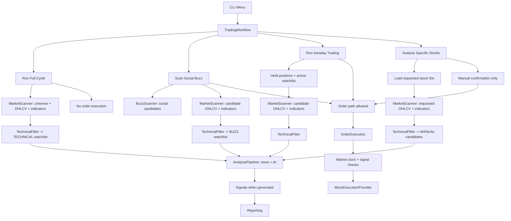

# TW Stock Alpha Agent

Application for Taiwan stock screening, report generation, watchlist management, and mock trade execution.

The current primary interface is the CLI. It scans Taiwan stocks, finds social buzz, runs technical and AI analysis, builds watchlists, and can submit orders through the currently wired mock execution provider.

This project is not financial advice. Treat generated signals as decision support.

## Current Status

- Market: Taiwan stocks.
- Primary UI: CLI at `backend/src/d_presentation/cli/interactive.py`.
- API: FastAPI is present, but the current web router exposes LINE webhook plumbing, not the trading workflow menu.
- Order execution: the CLI composition currently wires `MockExecutionProvider`.
- Database: local SQLite at `stock_agent.db` unless PostgreSQL credentials are provided.
- Knowledge store: ChromaDB path is configured by `config/appsetting.yaml`.

## CLI Workflows

Run the CLI from the repository root:

```powershell
just cli
```

Or run it directly:

```powershell
cd backend
uv sync --all-extras
$env:PYTHONPATH = "src"
uv run python -m d_presentation.cli.interactive
```

Menu behavior:

| Option | Workflow | What it does | Orders |
| --- | --- | --- | --- |
| 1 | Run Full Cycle | Scans the full market, builds a `TECHNICAL` watchlist, runs news and AI analysis, generates next-session signals. | Never submits orders. |
| 2 | Scan Social Buzz | Finds discussed stocks, enriches market data, keeps technical survivors as `BUZZ`, analyses them, generates signals. | Submits only if market and order checks allow. |
| 3 | Run Intraday Trading | Loads held positions and active watchlist, refreshes market data, revalidates technicals and AI, generates signals. | Submits only if market and order checks allow. |
| 4 | Analyse Specific Stocks | Loads the requested stock IDs, runs technical and AI report generation, returns passing stocks as `MANUAL` watchlist candidates. | No automatic order. Manual BUY override requires confirmation. |

### Specific Stock Flow

When you enter a stock such as `2330`, the app should only research that stock:

1. Load the stock from the stock provider.
2. Fetch OHLCV data and calculate indicators.
3. Run the technical filter.
4. Run news and AI analysis for technical survivors.
5. Show the stock report.
6. If it passes, expose a `MANUAL` watchlist candidate.

Adding the stock to the watchlist is a separate manual confirmation. A manual BUY override is also separate and still goes through `OrderExecution`, which checks market-open status and valid signal quantity.

## What Counts As "Good"

The project currently treats a stock as worth acting on only after multiple gates:

1. Technical filter has no hard failure.
2. News and AI analysis produce an acceptable report.
3. Combined score passes configured thresholds.
4. Account risk checks do not block the stock.
5. Order execution is allowed by the market clock.
6. Quantity and mock account constraints are valid.

Main thresholds live in `config/appsetting.yaml`:

```yaml
analysis:
  active_strategy: moderate
  technical_weight: 0.5
  sentiment_weight: 0.5
  min_combined_score_buy: 80
  max_combined_score_sell: 30
```

Strategy-specific technical thresholds live in `config/strategies.yaml`.

## Watchlist Types

`WatchlistType` is the source of truth for why a stock is on the watchlist:

| Type | Meaning |
| --- | --- |
| `TECHNICAL` | Passed the full-market technical scan. |
| `BUZZ` | Came from social buzz and passed technical filtering. |
| `TECHNICAL_AND_BUZZ` | Existing technical and buzz entries were merged by the repository. |
| `MANUAL` | User reviewed a specific-stock report and manually added it. |

Manual entries take precedence when an existing watchlist row is merged.

## Application Flow



Important distinction:

- `AnalysisPipeline` only runs news feed and AI analysis.
- `TradingWorkflow` decides which use cases run and whether signals, reporting, watchlist persistence, or order execution should happen.
- `MarketScanner` currently does both candidate loading and OHLCV plus indicator enrichment. There is no separate market-data use case right now.

## Architecture

The code follows the existing Clean Architecture split:

| Layer | Path | Responsibility |
| --- | --- | --- |
| Domain | `backend/src/a_domain` | Models, ports, enums, pure rules. No application, infrastructure, or presentation imports. |
| Application | `backend/src/b_application` | Use cases, workflow orchestration, pipeline context, config schemas, factories. |
| Infrastructure | `backend/src/c_infrastructure` | Database, market data, AI adapters, feed providers, LINE platform, mock trading. |
| Presentation | `backend/src/d_presentation` | CLI, FastAPI routers, dependency wiring, desktop entry points. |

Application use cases coordinate work. Domain rules own business decisions. Infrastructure implements ports.

## Configuration

Main files:

| File | Purpose |
| --- | --- |
| `config/appsetting.yaml` | Active model, logging, analysis weights, thresholds, folders, mock account, indicator periods. |
| `config/strategies.yaml` | Technical screening thresholds for `conservative`, `moderate`, `aggressive`, `buzz`, and `nightly`. |
| `config/instructions.yaml` | AI report prompts and RAG injection prompts. |
| `.env` | API keys and optional database credentials. |

Environment variables are loaded from `.env` or `../.env` relative to the backend process. Common keys:

```env
OPENAI_API_KEY=
GROK_API_KEY=
GEMINI_API_KEY=
GROQ_API_KEY=
TAVILY_API_KEY=
LINE_CHANNEL_ID=
LINE_CHANNEL_SECRET=
LINE_CHANNEL_ACCESS_TOKEN=
DB_USER=
DB_PASSWORD=
DB_HOST=
DB_PORT=
DB_NAME=
```

If PostgreSQL credentials are missing, the app uses local SQLite.

## Development Commands

From `backend`:

```powershell
uv sync --all-extras
$env:PYTHONPATH = "src"
uv run ruff check src tests
uv run python -m compileall src tests
uv run pytest
```

Run the API:

```powershell
cd backend
$env:PYTHONPATH = "src"
uv run uvicorn main:app --host 0.0.0.0 --port 8800 --reload
```

Run Docker:

```powershell
docker compose up --build
```

## Data Written Locally

- `stock_agent.db`: SQLite application and mock trading state.
- `chroma_data/`: Chroma persistence.
- `news_archive/`: archived news payloads.
- `buzz_archive/`: archived social buzz payloads.
- `ai_responses/`: saved AI outputs.

## Safety Rules

- Closed-market orders are skipped by `OrderExecution`.
- `Run Full Cycle` does not call order execution.
- Manual BUY override is explicit user intent and still uses the same order checks.
- The current CLI uses mock trading. A live execution provider must be wired intentionally before real brokerage orders are possible.

## Known Cleanup Areas

- Split manual watchlist addition and manual BUY override into clearer use cases.
- Decide whether `MarketScanner` should stay responsible for both universe loading and market-data enrichment.
- Keep `PipelineContext.all_stocks` as a list. Dedupe by `stock_id`; do not convert it to `set`.
- Keep README, CLI text, workflow behavior, and tests aligned whenever a workflow changes.
